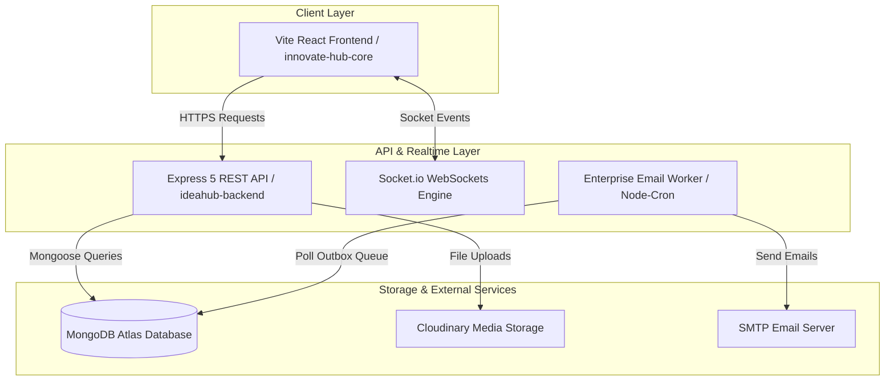
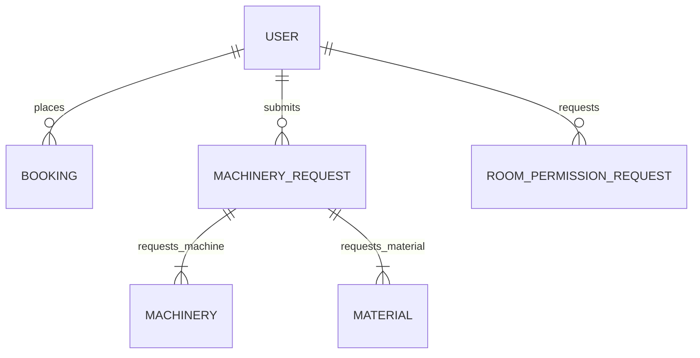

# 💡 AICTE IDEA Lab Platform

[](https://opensource.org/licenses/ISC)
[](https://nodejs.org/)
[](https://react.dev/)
[](https://expressjs.com/)
[](https://www.mongodb.com/)
[](https://tailwindcss.com/)
[](https://socket.io/)

---

## 📌 Short Description

The **AICTE IDEA Lab Platform** is an enterprise-grade digital innovation hub developed for **K. K. Wagh Institute of Engineering Education and Research (KKWIEER)**. It integrates advanced prototyping machinery allocation, room permission scheduling, student club management, event ticketing, and achievement showcases into a unified monorepo architecture.

---

## 📑 Table of Contents

- [📌 Short Description](#-short-description)
- [❓ Problem Statement](#-problem-statement)
- [💡 Solution](#-solution)
- [✨ Key Features](#-key-features)
  - [🛠️ 1. Advanced Machinery & Material Management](#️-1-advanced-machinery--material-management)
  - [🏫 2. Special Room & Slot Permissions](#-2-special-room--slot-permissions)
  - [👥 3. Student Clubs, Events & Showcase](#-3-student-clubs-events--showcase)
- [🔄 How It Works](#-how-it-works)
- [🏗️ Project Architecture](#%EF%B8%8F-project-architecture)
- [📁 Folder Structure](#-folder-structure)
- [🛠️ Technology Stack](#%EF%B8%8F-technology-stack)
- [🗄️ Database Design](#%EF%B8%8F-database-design)
- [📡 API Documentation](#-api-documentation)
- [🔐 Authentication & Authorization](#-authentication--authorization)
- [🔒 Security Implementation](#-security-implementation)
- [💻 Installation & Setup](#-installation--setup)
- [🔑 Environment Variables Reference](#-environment-variables-reference)
- [🖼️ Screenshots](#-screenshots)
- [⚡ Usage Guidelines](#-usage-guidelines)
- [🚨 Error Handling](#-error-handling)
- [🚀 Performance Optimizations](#-performance-optimizations)
- [📦 Deployment Architecture](#-deployment-architecture)
- [🔮 Future Improvements](#-future-improvements)
- [⚠️ Current Limitations](#%EF%B8%8F-current-limitations)
- [🤝 Contributing](#-contributing)
- [📜 License](#-license)
- [👨‍💻 Author](#-author)
- [🙏 Acknowledgements](#-acknowledgements)

---

## ❓ Problem Statement

Educational institutions and innovation centers face significant operational hurdles when managing hardware incubation labs and campus prototyping facilities:

- **Fragmented Approvals**: Machinery reservation (3D printers, CNCs, PCB printers) relies on paper applications or manual emails, causing approval bottlenecks across department heads and lab coordinators.
- **Resource Conflicts & Overbooking**: Lack of centralized scheduling leads to double-booking of specialized rooms and unmonitored equipment usage.
- **Material Tracking Deficits**: Consumables (filaments, electronic components, raw materials) are issued without structured inventory tracking or automated return verification.
- **Lack of Multi-Tier Workflow Control**: Student innovation projects lack a structured pipeline to submit CAD models, project details, and benefit statements to faculty and coordinators.

---

## 💡 Solution

The **AICTE IDEA Lab Platform** resolves these challenges by providing a centralized web platform featuring:

1. **Multi-Tier RBAC Approval Workflows**: Structured application pathways with automated role routing for Students, Faculty Guides, Coordinators, and the IDEA Lab Head.
2. **Precision Equipment & Slot Scheduling**: Real-time room booking with automated QR-code pass generation and time-bounded entry/exit logging.
3. **Material & Inventory Tracking**: Structured material allocation, issue/return logging, and equipment condition monitoring.
4. **Resilient Background Processing**: Enterprise email outbox worker built on Node-Cron to guarantee asynchronous mail delivery without blocking HTTP request execution loops.

---

## ✨ Key Features

### 🛠️ 1. Advanced Machinery & Material Management
- **Multi-Stage Application Pipeline**: Submit comprehensive project applications specifying requested machines, unit numbers, required materials, CAD models, and circuit diagrams.
- **Dual Applicant Types**: Automatic classification of applicants into **INTERNAL** (domain-verified `@kkwagh.edu.in`) and **EXTERNAL** (industry partners, external college students).
- **Material Issue & Return Ledger**: Track requested vs. issued quantities, return dates, material condition status (`Good`, `Damaged`, `Consumed`), and remaining balances.
- **CAD & Circuit File Integration**: Secure document uploading powered by Cloudinary for engineering design file review.

### 🏫 2. Special Room & Slot Permissions
- **Faculty Verification Loop**: Direct email/dashboard recommendation link for Faculty Guides before requests escalate to Coordinators.
- **Dynamic Slot Reservation**: Booking grid supporting custom time durations, team capacity limits, and purpose classification.
- **Automated Pass Generation**: Instant QR Code generation (`pdfkit` / `qrcode`) for physical lab entry verification.
- **Overstay Monitoring**: Automated status transitions flagging bookings that exceed approved time boundaries.

### 👥 3. Student Clubs, Events & Showcase
- **Club Management**: Hub for institutional engineering clubs (Robotics, Aero, IoT) to showcase achievements, leadership, and ongoing projects.
- **Event Ticketing System**: Event registration with automated PDF pass issuing and attendee check-in management.
- **Hall of Fame & Achievements**: Portfolio showcase of student innovation, competition victories, and patent filings.

---

## 🔄 How It Works

```
┌─────────────┐       HTTP / REST       ┌──────────────────┐      Mongoose ODM      ┌─────────────────┐
│ React (Vite)│ ──────────────────────> │ Node.js Express  │ ─────────────────────> │ MongoDB Atlas   │
│ Client UI   │ <────────────────────── │ API Server       │ <───────────────────── │ Database        │
└─────────────┘       JSON Response     └──────────────────┘      BSON Documents    └─────────────────┘
                                                 │                                           │
                                                 │ Background Worker (Node-Cron)             │ Cloud Media
                                                 ▼                                           ▼
                                        ┌──────────────────┐                        ┌─────────────────┐
                                        │ Enterprise Email │                        │ Cloudinary File │
                                        │ Outbox Queue     │                        │ Storage         │
                                        └──────────────────┘                        └─────────────────┘
```

### End-to-End User Request Flow

```
[User Action] (e.g., Submit Machinery Request)
       ↓
[Frontend Validation] (Zod / React Hook Form)
       ↓
[HTTP POST Request] (Bearer JWT Header)
       ↓
[Express Auth Middleware] (Token Verification & Role Guard)
       ↓
[Controller Logic] (Generate Request ID, Save to MongoDB)
       ↓
[Email Queue Ingestion] (Push Notification Email to Outbox)
       ↓
[Cron Worker Execution] (Asynchronous Dispatch via SMTP Nodemailer)
       ↓
[Socket.io Broadcast] (Notify Coordinator Dashboard in Real Time)
       ↓
[HTTP 201 Created] → [Updated Client UI Toast]
```

---

## 🏗️ Project Architecture

The monorepo follows a decoupled **Client-Server Architecture** with integrated WebSocket event broadcasting and asynchronous background worker processing:



---

## 📁 Folder Structure

```
IdeaHub Monorepo
│
├── ideahub-backend/                 # Node.js Express REST API & Socket Server
│   ├── src/
│   │   ├── config/                  # Database connection setup
│   │   │   └── db.js
│   │   ├── controllers/             # Business logic handlers
│   │   ├── middlewares/             # JWT auth, role validation, error handlers
│   │   ├── models/                  # Mongoose MongoDB schemas
│   │   │   ├── User.js              # User profiles & RBAC roles
│   │   │   ├── MachineryRequest.js  # Machinery workflow schema
│   │   │   ├── RoomPermissionRequest.js # Room scheduling schema
│   │   │   └── ...
│   │   ├── routes/                  # Express API endpoint definitions
│   │   ├── utils/                   # Enterprise email worker, PDF & QR helpers
│   │   ├── scheduler.js             # Cron job schedules for overstay checks
│   │   └── server.js                # Server entry point & Socket.io server
│   ├── uploads/                     # Local static asset fallback storage
│   ├── package.json                 # Backend dependencies & scripts
│   └── .env                         # Server environment configuration
│
├── innovate-hub-core/              # React 18 + Vite + TypeScript Frontend
│   ├── src/
│   │   ├── api/                     # Axios instance & API request handlers
│   │   ├── components/              # Reusable UI components & shadcn primitives
│   │   ├── hooks/                   # Custom React hooks (auth, socket, query)
│   │   ├── pages/                   # Main view components
│   │   │   ├── coordinator/        # Coordinator administrative views
│   │   │   ├── head/               # IDEA Lab Head executive views
│   │   │   ├── machinery/          # Machinery request forms & listings
│   │   │   ├── BookSlots.tsx       # Room slot booking view
│   │   │   └── ...
│   │   ├── store/                   # Zustand global state stores
│   │   ├── App.tsx                  # Router setup & main component tree
│   │   └── main.tsx                 # React DOM root render
│   ├── public/                      # Static assets & web manifest
│   ├── tailwind.config.ts           # Styling design tokens & custom colors
│   ├── vite.config.ts               # Build configuration & dev server proxy
│   └── package.json                 # Frontend dependencies
│
├── package.json                     # Monorepo root package configuration
└── README.md                        # Documentation
```

### Key Directory Explanations
- `ideahub-backend/src/models`: Contains Mongoose schemas defining all application entities including Users, Room Requests, Machinery Requests, and Audit Trails.
- `ideahub-backend/src/routes`: Contains modularized Express routers handling specific resource endpoints.
- `ideahub-backend/src/utils/enterpriseEmailWorker.js`: Background task process that periodically queries the `EmailQueue` collection to send pending email notifications via SMTP.
- `innovate-hub-core/src/pages`: Modular frontend views structured into logical role-based folders (`head`, `coordinator`, `machinery`).

---

## 🛠️ Technology Stack

| Technology | Purpose | Why It Was Chosen |
| :--- | :--- | :--- |
| **React 18** | Frontend UI Framework | Component-based structure, fast virtual DOM rendering, and robust ecosystem. |
| **TypeScript** | Type Safety | Catch syntax/type errors during development, providing strict contract enforcement. |
| **Vite** | Frontend Build Tool | Near-instantaneous Hot Module Replacement (HMR) and optimized production bundles. |
| **Tailwind CSS** | Styling System | Utility-first CSS framework allowing rapid, consistent, and customizable responsive designs. |
| **shadcn/ui** | UI Component Library | Accessible, headless primitives built on top of Radix UI with full visual customization. |
| **Zustand** | State Management | Lightweight, boilerplate-free state store for global user authentication state. |
| **TanStack Query** | Data Fetching & Caching | Automatic background refetching, query invalidation, and declarative loading/error states. |
| **Node.js & Express 5** | Backend Runtime & Server | Non-blocking I/O event loop suitable for concurrent API requests and WebSockets. |
| **MongoDB & Mongoose** | Database & ODM | Flexible document schema modeling complex nested forms (e.g., student cards, multi-step approvals). |
| **Socket.io** | Real-Time Engine | Bi-directional WebSocket communication for instant notifications and dynamic status updates. |
| **Nodemailer & Node-Cron** | Email Automation | Reliable background worker architecture for queue-based transactional email delivery. |
| **Cloudinary** | Cloud Storage | Secure asset storage and image optimization for CAD designs, identity proofs, and avatars. |

---

## 🗄️ Database Design

The system utilizes MongoDB Atlas with Mongoose schemas configured with indexes for optimal querying performance.



### Key Collections & Schema Structures

#### 1. `User`
Stores user credentials, organizational metadata, and role assignments.
- **Important Fields**: `name`, `email` (indexed, unique), `passwordHash`, `role` (`team`, `coordinator`, `head`, `admin`), `userType` (`INTERNAL`, `EXTERNAL`), `prn`, `department`, `year`, `branch`.
- **Indexes**: `{ email: 1 }`, `{ role: 1 }`.

#### 2. `MachineryRequest`
Captures multi-section machinery and material reservation applications.
- **Important Fields**: `requestId` (unique string), `projectName`, `projectCategory`, `students` (array of student details), `requestedMachines`, `requestedMaterials`, `uploadedFiles` (CAD/Circuit URLs), `status`, `materialAllocations`, `approvalHistory`.
- **Indexes**: `{ status: 1 }`, `{ requestId: 1 }`, `{ studentId: 1 }`.

#### 3. `RoomPermissionRequest`
Handles special room slot reservation applications.
- **Important Fields**: `requestId` (unique string), `facilityRequired`, `purpose`, `applicantDetails`, `schedule` (`requestedDate`, `startTime`, `endTime`, `duration`), `facultyRecommendation`, `status`, `approvalHistory`.
- **Indexes**: `{ status: 1 }`, `{ "schedule.requestedDate": 1 }`.

#### 4. `Booking`
Manages general lab desk and workspace slot reservations.
- **Important Fields**: `team` (ref: `User`), `room` (ref: `Room`), `slotDate`, `startTime`, `endTime`, `status` (`pending`, `approved`, `rejected`, `completed`, `overstayed`), `qrCode`.
- **Indexes**: `{ slotDate: 1, startTime: 1, endTime: 1, room: 1, status: 1 }`.

---

## 📡 API Documentation

### Authentication & Authorization Endpoints

#### `POST /api/auth/register`
- **Purpose**: Registers a new user (internal student or external guest).
- **Authentication Required**: None
- **Example Request**:
  ```json
  {
    "name": "Jane Doe",
    "email": "janedoe@kkwagh.edu.in",
    "password": "SecurePassword123!",
    "mobile": "9876543210",
    "year": "TE",
    "branch": "Computer Engineering",
    "prn": "72134568K"
  }
  ```
- **Example Response (`201 Created`)**:
  ```json
  {
    "message": "User registered successfully",
    "token": "eyJhbGciOiJIUzI1NiIsInR5cCI6IkpXVCJ9...",
    "user": {
      "id": "64f1a2b3c4d5e6f7a8b9c0d1",
      "name": "Jane Doe",
      "email": "janedoe@kkwagh.edu.in",
      "role": "team",
      "userType": "INTERNAL"
    }
  }
  ```

#### `POST /api/auth/login`
- **Purpose**: Authenticates a user and returns a JSON Web Token.
- **Authentication Required**: None
- **Example Request**:
  ```json
  {
    "email": "janedoe@kkwagh.edu.in",
    "password": "SecurePassword123!"
  }
  ```
- **Example Response (`200 OK`)**:
  ```json
  {
    "token": "eyJhbGciOiJIUzI1NiIsInR5cCI6IkpXVCJ9...",
    "user": {
      "id": "64f1a2b3c4d5e6f7a8b9c0d1",
      "name": "Jane Doe",
      "role": "team"
    }
  }
  ```

---

### Machinery Request Endpoints

#### `POST /api/machinery/request`
- **Purpose**: Submits a new multi-resource machinery and material request.
- **Authentication Required**: Yes (`team`, `admin`)
- **Example Request**:
  ```json
  {
    "projectName": "Autonomous Drone Prototype",
    "projectCategory": "Innovation Project",
    "projectDescription": "Quadcopter frame manufacturing using 3D printing and carbon fiber routing.",
    "projectObjectives": "Produce lightweight frame components",
    "expectedOutcome": "Functional prototype for national competition",
    "students": [
      {
        "name": "Jane Doe",
        "prn": "72134568K",
        "branch": "Computer Engineering",
        "year": "TE",
        "division": "A",
        "mobile": "9876543210",
        "email": "janedoe@kkwagh.edu.in"
      }
    ],
    "requestedMachines": [
      {
        "machineId": "64f1a2b3c4d5e6f7a8b9c0d2",
        "machineName": "Ender 3 3D Printer",
        "usageDate": "2026-08-10",
        "startTime": "10:00",
        "endTime": "14:00",
        "usageHours": 4
      }
    ]
  }
  ```
- **Example Response (`201 Created`)**:
  ```json
  {
    "message": "Machinery request submitted successfully",
    "requestId": "MR-202608-0042",
    "status": "Submitted"
  }
  ```

#### `GET /api/machinery/requests`
- **Purpose**: Fetches submitted machinery applications filtered by user ownership or admin role.
- **Authentication Required**: Yes
- **Example Response (`200 OK`)**:
  ```json
  {
    "success": true,
    "count": 1,
    "data": [
      {
        "_id": "64f1a2b3c4d5e6f7a8b9c0d3",
        "requestId": "MR-202608-0042",
        "projectName": "Autonomous Drone Prototype",
        "status": "Coordinator Review",
        "applicationDate": "2026-08-01T00:30:00.000Z"
      }
    ]
  }
  ```

---

## 🔐 Authentication & Authorization

Authentication is built around industry-standard **JSON Web Tokens (JWT)** and Role-Based Access Control (RBAC).

```
               ┌────────────────────────────────────────────────────────┐
               │                     User Privilege                     │
               └────────────────────────────────────────────────────────┘
  Low Level                                                                     High Level
     │                                                                              │
     ▼                                                                              ▼
┌───────────┐                        ┌───────────┐                        ┌───────────────────┐
│   Team    │ ─────────────────────> │Coordinator│ ─────────────────────> │   IDEA Lab Head   │
│ (Student) │                        │ (Reviewer)│                        │(Executive Approver)│
└───────────┘                        └───────────┘                        └───────────────────┘
```

### Access Control Matrix

| Role | Submit Requests | Approve Requests | Manage Inventory | Site Admin |
| :--- | :---: | :---: | :---: | :---: |
| `team` | **Yes** | No | No | No |
| `coordinator` | **Yes** | **Initial Level** | **Yes** | No |
| `head` | **Yes** | **Final Level** | **Yes** | **Yes** |
| `admin` | **Yes** | **Full Access** | **Yes** | **Yes** |

### User Domain Self-Classification
When a user signs up, the system automatically checks their email domain against `INTERNAL_EMAIL_DOMAIN` (e.g., `kkwagh.edu.in`).
- **`INTERNAL`**: Granted direct access to student pricing and internal institutional features.
- **`EXTERNAL`**: Prompts for additional verification (organization, identity proof upload, external city/state).

---

## 🔒 Security Implementation

- **Password Hashing**: Passwords are salted and hashed using `bcryptjs` before storage.
- **JWT Authorization**: Requests to protected routes require a `Bearer <token>` HTTP header, decoded using `jsonwebtoken`.
- **CORS Protection**: Dynamic origin validation restrict requests to trusted localhost ports and production hostnames (`FRONTEND_ORIGIN`).
- **Input Validation**: Express routes utilize `express-validator` and frontend forms enforce strict schemas with `zod`.
- **Payload Limits**: JSON request body sizes are capped (`1mb`) to prevent Denial of Service (DoS) memory exhaustion attacks.
- **Isolated Credentials**: Sensitive tokens, database URIs, and cloud keys are strictly injected via `.env` files.

---

## 💻 Installation & Setup

### Prerequisites
Before getting started, ensure you have the following tools installed locally:
- [Node.js](https://nodejs.org/) (`v18.0.0` or higher)
- [npm](https://www.npmjs.com/) (`v9.0.0` or higher)
- [MongoDB](https://www.mongodb.com/) (Local instance or MongoDB Atlas URI)

---

### Step 1: Clone Repository
```bash
git clone https://github.com/kkwideahubofficial-eng/KKW-IdeaLab-Official.git
cd KKW-IdeaLab-Official
```

---

### Step 2: Install Dependencies
Run the root install script to install dependencies across the monorepo:
```bash
npm run install:all
```

---

### Step 3: Configure Environment Variables

#### Backend Environment (`ideahub-backend/.env`)
Create a `.env` file inside the `ideahub-backend` directory:
```env
PORT=5000
MONGO_URI=mongodb://localhost:27017/ideahub
JWT_SECRET=your_super_secret_jwt_key
FRONTEND_ORIGIN=http://localhost:5173
INTERNAL_EMAIL_DOMAIN=kkwagh.edu.in

# Cloudinary Configuration
CLOUDINARY_CLOUD_NAME=your_cloud_name
CLOUDINARY_API_KEY=your_api_key
CLOUDINARY_API_SECRET=your_api_secret

# SMTP Email Configuration
EMAIL_USER=your_email@gmail.com
EMAIL_PASS=your_app_specific_password
```

#### Frontend Environment (`innovate-hub-core/.env`)
Create a `.env` file inside the `innovate-hub-core` directory:
```env
VITE_API_URL=http://localhost:5000/api
VITE_SOCKET_URL=http://localhost:5000
```

---

### Step 4: Run Application locally

Run the primary backend and frontend concurrently from the root directory:
```bash
npm run dev
```

The application services will be available at:
- 🌐 **Frontend App**: `http://localhost:5173`
- ⚙️ **Backend REST API**: `http://localhost:5000`

---

### Step 5: Production Build

To build the frontend and bundle it into the Express backend for single-server production deployment:
```bash
npm run render-build
npm start --prefix ideahub-backend
```

---

## 🔑 Environment Variables Reference

| Variable | Required | Description | Default Value |
| :--- | :---: | :--- | :--- |
| `PORT` | No | Port number on which the backend server listens | `5000` |
| `MONGO_URI` | **Yes** | MongoDB connection string (Atlas or Local instance) | `mongodb://localhost:27017/ideahub` |
| `JWT_SECRET` | **Yes** | Secret string used for signing authentication JWT tokens | `dev_local_secret` |
| `FRONTEND_ORIGIN` | **Yes** | Allowed CORS origins (comma-separated for multiple origins) | `http://localhost:5173` |
| `INTERNAL_EMAIL_DOMAIN` | No | Domain string used to identify internal college students | `kkwagh.edu.in` |
| `CLOUDINARY_CLOUD_NAME` | No | Cloudinary cloud account identifier for file storage | - |
| `CLOUDINARY_API_KEY` | No | Cloudinary API Key | - |
| `CLOUDINARY_API_SECRET` | No | Cloudinary API Secret | - |
| `EMAIL_USER` | No | SMTP username/email for sending transactional outbox emails | - |
| `EMAIL_PASS` | No | SMTP app password for email authentication | - |

---

## 🖼️ Screenshots

> [!NOTE]
> Below are placeholders for visual mockups of key user interfaces.

| Home Landing Page | Machinery Booking Form |
| :---: | :---: |
|  |  |

| Coordinator Dashboard | Achievements & Student Clubs Hub |
| :---: | :---: |
|  |  |

---

## ⚡ Usage Guidelines

### 1. Student / Team Workflow
1. Register/Login using institutional email `@kkwagh.edu.in`.
2. Navigate to **Machinery Booking** to submit a multi-page request specifying CAD files and machine time slots.
3. Track application status (`Submitted` → `Coordinator Review` → `Approved`) on your profile page.
4. Access student club portals and register for institutional events.

### 2. Coordinator Workflow
1. Access the **Coordinator Dashboard** to view incoming room slot applications and machinery requests.
2. Review student eligibility, check material stock availability, and click **Approve** or **Request Changes**.
3. Manage student club content and publish new campus events.

### 3. IDEA Lab Head Executive Workflow
1. Review escalated machinery requests requiring final executive approval or external user billing clearance.
2. Grant **Conditional Approvals**, add custom usage conditions, or allocate institutional grants.
3. Access high-level analytics on equipment utilization rates, student engagement metrics, and material consumption.

---

## 🚨 Error Handling

The platform implements unified client-side and server-side error handling:

- **Global Express Error Handler**: Intercepts unhandled synchronous and asynchronous exceptions, returning sanitized JSON responses.
  ```json
  {
    "message": "Internal Server Error",
    "error": "Detailed message in development environment"
  }
  ```
- **HTTP Status Codes**:
  - `400 Bad Request`: Validation failure or missing mandatory payload fields.
  - `401 Unauthorized`: Missing or invalid JWT Bearer token.
  - `403 Forbidden`: Insufficient role privileges (e.g., Student attempting Coordinator action).
  - `404 Not Found`: Requested resource or endpoint does not exist.
  - `500 Internal Server Error`: Server-side database or processing failure.

---

## 🚀 Performance Optimizations

- **Component Lazy Loading**: React page routes are dynamically imported (`React.lazy()` / `Suspense`) to minimize initial JavaScript bundle size.
- **Database Query Indexing**: Critical MongoDB schema fields (`requestId`, `status`, `slotDate`, `email`) are indexed to maintain sub-millisecond query response times.
- **Asynchronous Email Outbox**: Email notifications are decoupled from HTTP request handler threads using an outbox queue pattern (`EmailQueue` + `node-cron`).
- **Optimized Re-renders**: Zustand state selectors and React Query caching reduce unnecessary DOM re-renders.

---

## 📦 Deployment Architecture

The monorepo supports single-host unified deployment (e.g., Render, Railway) or decoupled multi-host deployment (Vercel + Render + MongoDB Atlas).

```
┌────────────────────────────────────────────────────────────────────────┐
│                        Production Deployment Host                      │
│                                (e.g., Render)                          │
│                                                                        │
│  ┌─────────────────────────────┐      ┌─────────────────────────────┐  │
│  │ Express Node.js Server      │      │ React Static Distribution   │  │
│  │ (Runs on Port 5000 / $PORT) │ ───> │ (/public/index.html SPA)    │  │
│  └─────────────────────────────┘      └─────────────────────────────┘  │
└────────────────────────────────────────────────────────────────────────┘
                                    │
                         ┌──────────┴──────────┐
                         ▼                     ▼
              ┌─────────────────────┐┌───────────────────┐
              │ MongoDB Atlas Cloud ││ Cloudinary CDN    │
              └─────────────────────┘└───────────────────┘
```

1. **Build Step (`npm run render-build`)**:
   - Installs dependencies across all sub-packages.
   - Compiles the Vite React application into `innovate-hub-core/dist`.
   - Copies production static bundle into `ideahub-backend/public`.
2. **Start Step**:
   - Launches `ideahub-backend/src/server.js` which serves both REST API endpoints (`/api/*`) and static client files with an SPA fallback route.

---

## 🔮 Future Improvements

- [ ] **AI-Powered Slot Recommendations**: Machine learning model to predict lab room availability and suggest optimal prototype build slots.
- [ ] **Automated Hardware Access (IoT)**: Integration with ESP32-based RFID readers to unlock lab doors automatically upon scanning valid QR passes.
- [ ] **Multi-College Lab Federation**: Expand platform to support multi-tenant IDEA Labs across different university campuses.

---

## ⚠️ Current Limitations

- **SMTP Gateway Rate Limits**: Email queue worker depends on configured SMTP server rate limits (e.g., Gmail 500 emails/day limit).

---

## 🤝 Contributing

Contributions are welcome! Please follow these steps:

1. Fork the Repository.
2. Create a Feature Branch (`git checkout -b feature/AmazingFeature`).
3. Commit your Changes (`git commit -m 'Add some AmazingFeature'`).
4. Push to the Branch (`git push origin feature/AmazingFeature`).
5. Open a Pull Request.

---

## 📜 License

Distributed under the **ISC License**. See `LICENSE` for more information.

---

## 👨‍💻 Authors & Contributors

**Roshan Gaikwad**
- **GitHub**: [@RoshanGaikwad2006](https://github.com/RoshanGaikwad2006)
- **Role**: Full-Stack Developer & Maintainer

**Kalpesh Bire**
- **GitHub**: [@KalpeshBire](https://github.com/KalpeshBire)
- **Role**: Full-Stack Developer & Maintainer

---

## 🙏 Acknowledgements

- **AICTE (All India Council for Technical Education)** for initiating the IDEA Lab initiative.
- **K. K. Wagh Institute of Engineering Education and Research (KKWIEER)** for institutional support and guidance.
- **React, Express, MongoDB, and Tailwind CSS Communities** for providing open-source tools.
